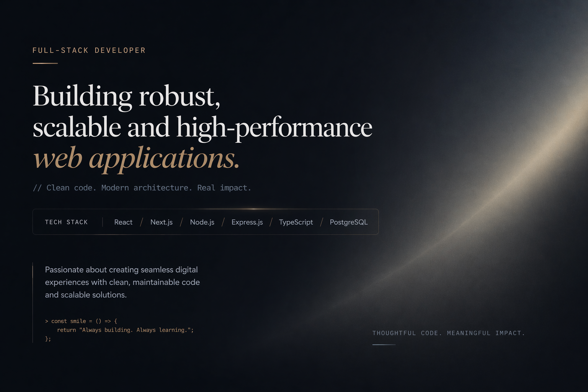

  

  

## 🧠 Tech Stack

### 🎨 Frontend

  

### ⚙️ Backend

  

### 🗄️ Database & DevOps

  

---

## 🏆 Key Achievements

- 🚀 Built system handling **10,000+ real-time events**
- ⚡ Improved backend performance by **20–30%**
- 🔄 Designed scalable **microservices architecture**
- 🧪 Implemented **unit & integration testing pipelines**

---

## 🎯 Focus Areas

- Frontend Architecture (Vue / React ecosystem)
- High-load backend systems
- Real-time data processing
- Performance optimization
- Scalable microservices

---

## 📫 Contact

📧 ellenmartinelli0825@outlook.com  
🌍 Open to remote opportunities
